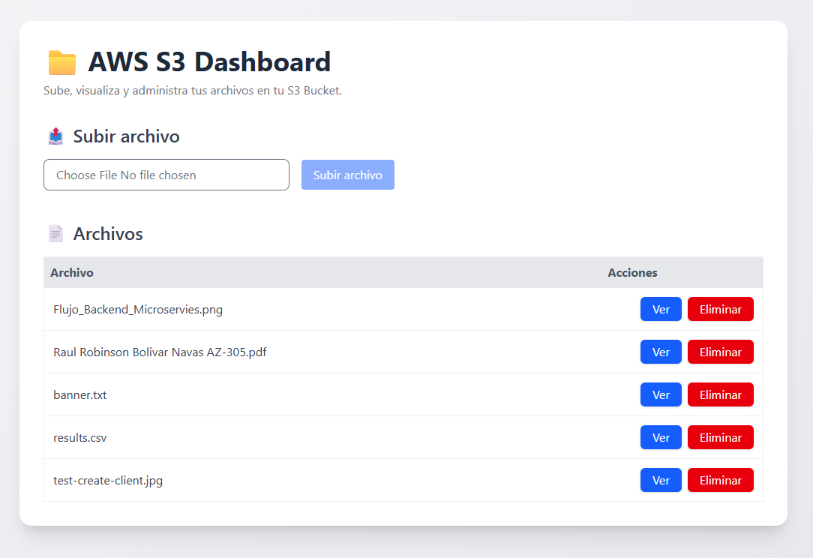
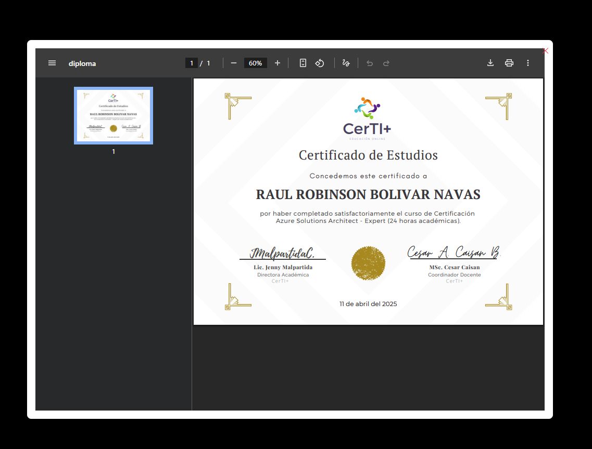

# AWS LocalStack

✅ Servicios incluidos:

- ***S3*** Service de almacenamiento de objetos.
- ***SQS*** Service de colas de mensajes.
- ***SNS*** Service de notificaciones.
- ***LAMBDA*** Service de funciones sin servidor.
- ***DYNAMODB*** Service de base de datos NoSQL.
- ***CLOUDWATCH*** Service de monitoreo y logs.
- ***APIGATEWAY*** Service de API Gateway.
- ***IAM*** Service de gestión de identidades y accesos.
- ***STS*** Service de seguridad y credenciales temporales.
- ***SECRETSMANAGER*** Service de gestión de secretos.
- ***EVENTS*** Service de eventos y reglas.
- ***LOGS*** Service de logs.
- ***EC2*** Service de instancias de máquinas virtuales.
- ***ROUTE53*** Service de DNS.
- ***SSM*** Service de gestión de sistemas.
- ***ECR*** Service de registro de contenedores.
- ***ECS*** Service de orquestación de contenedores.
- ***SES*** Service de envío de correos electrónicos.
- ***KINESIS*** Service de procesamiento de flujos de datos.
- ***CLOUDFORMATION*** Service de gestión de infraestructura como código.

✅ Dependencias necesarias
Instala la CLI de LocalStack (opcional pero útil):

```bash
pip install localstack awscli-local
```

AWS CLI para usar LocalStack:

```bash
aws configure
# Usa cualquier valor, por ejemplo:
# AWS Access Key ID [None]: test
# AWS Secret Access Key [None]: test
# Default region name [None]: us-east-1
# Default output format [None]: json
```

✅ Iniciar LocalStack

```bash
aws --endpoint-url=http://localhost:4566 o awslocal para interactuar con los servicios.
```

## Minio

Para usar Minio como alternativa a S3, puedes iniciar un contenedor de Minio:

```bash
docker run -d -p 9000:9000 -p 9001:9001 --name minio \
  -e "MINIO_ROOT_USER=admin" \
  -e "MINIO_ROOT_PASSWORD=admin123" \
  minio/minio server /data --console-address ":9001"
```

### Acceso a la consola de Minio

Abre tu navegador y accede a la consola de Minio en `http://localhost:9001` con las credenciales:
- Usuario: `admin`
- Contraseña: `admin123`

## DynamoDB Admin

Para administrar DynamoDB, puedes usar la herramienta DynamoDB Admin: 

```bash
docker run -d -p 8001:8001 --name dynamodb-admin \
  -e "DYNAMODB_ENDPOINT=http://host.docker.internal:4566" \
  --link localstack \
  --restart unless-stopped \
  aaronshaf/dynamodb-admin
```

### Acceso a la consola de DynamoDB Admin

Abre tu navegador y accede a la consola de DynamoDB Admin en `http://localhost:8001`.

## S3 Dashboard

Para administrar S3, puedes usar la herramienta S3 Dashboard:



