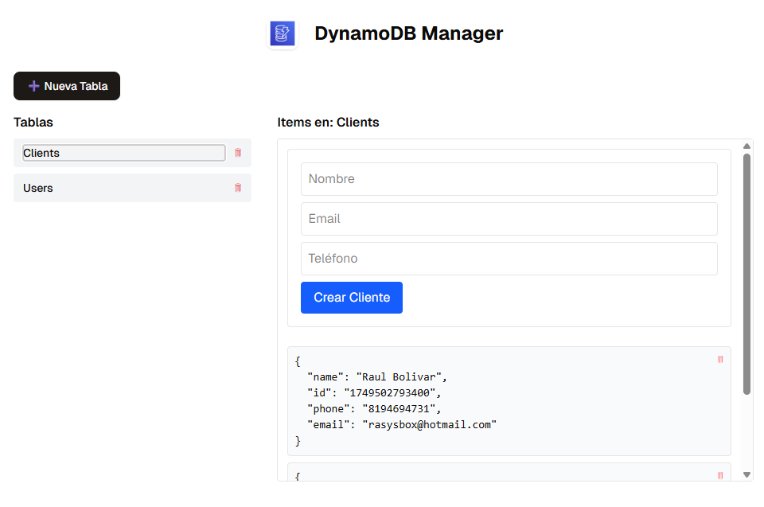
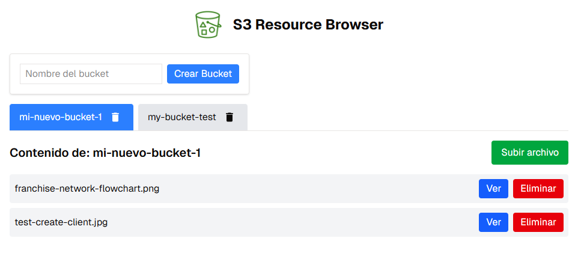
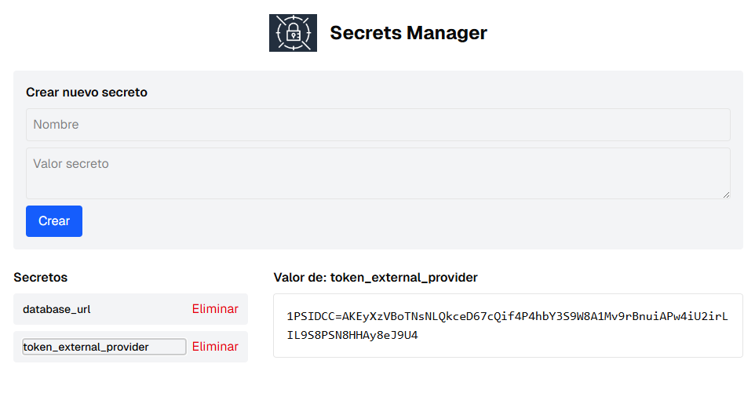
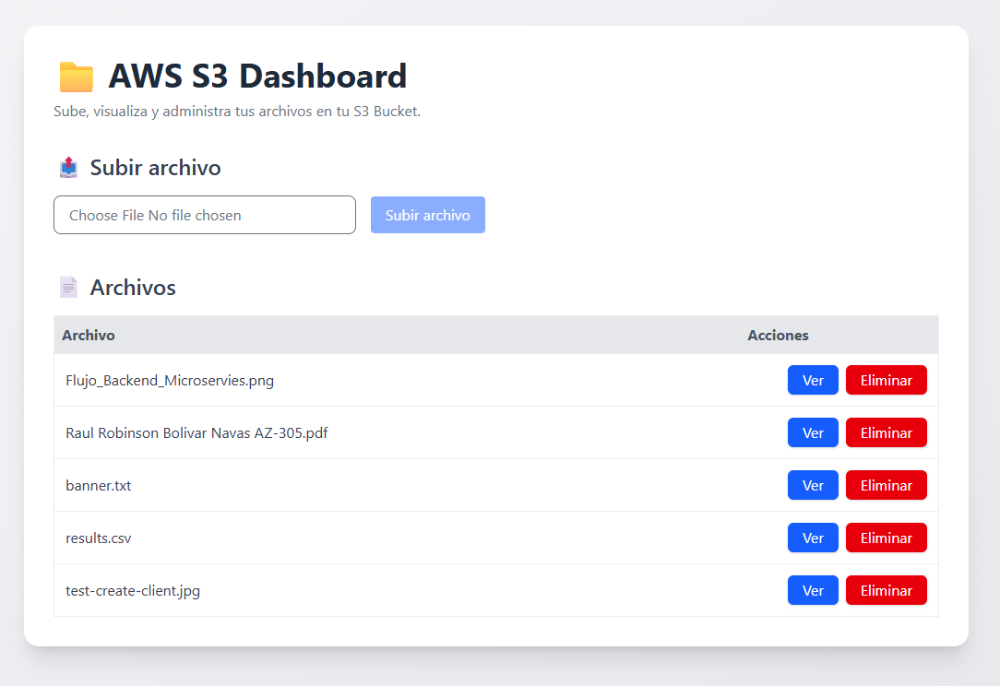

# AWS LocalStack

✅ Servicios incluidos:

- ***S3*** Service de almacenamiento de objetos.
- ***SQS*** Service de colas de mensajes.
- ***SNS*** Service de notificaciones.
- ***LAMBDA*** Service de funciones sin servidor.
- ***DYNAMODB*** Service de base de datos NoSQL.
- ***CLOUDWATCH*** Service de monitoreo y logs.
- ***APIGATEWAY*** Service de API Gateway.
- ***IAM*** Service de gestión de identidades y accesos.
- ***STS*** Service de seguridad y credenciales temporales.
- ***SECRETSMANAGER*** Service de gestión de secretos.
- ***EVENTS*** Service de eventos y reglas.
- ***LOGS*** Service de logs.
- ***EC2*** Service de instancias de máquinas virtuales.
- ***ROUTE53*** Service de DNS.
- ***SSM*** Service de gestión de sistemas.
- ***ECR*** Service de registro de contenedores.
- ***ECS*** Service de orquestación de contenedores.
- ***SES*** Service de envío de correos electrónicos.
- ***KINESIS*** Service de procesamiento de flujos de datos.
- ***CLOUDFORMATION*** Service de gestión de infraestructura como código.

✅ Dependencias necesarias
Instala la CLI de LocalStack (opcional pero útil):

```bash
pip install localstack awscli-local
```

AWS CLI para usar LocalStack:

```bash
aws configure
# Usa cualquier valor, por ejemplo:
# AWS Access Key ID [None]: test
# AWS Secret Access Key [None]: test
# Default region name [None]: us-east-1
# Default output format [None]: json
```

✅ Iniciar LocalStack

```bash
aws --endpoint-url=http://localhost:4566 o awslocal para interactuar con los servicios.
```

## Minio

Para usar Minio como alternativa a S3, puedes iniciar un contenedor de Minio:

```bash
docker run -d -p 9000:9000 -p 9001:9001 --name minio \
  -e "MINIO_ROOT_USER=admin" \
  -e "MINIO_ROOT_PASSWORD=admin123" \
  minio/minio server /data --console-address ":9001"
```

### Acceso a la consola de Minio

Abre tu navegador y accede a la consola de Minio en `http://localhost:9001` con las credenciales:
- Usuario: `admin`
- Contraseña: `admin123`

## DynamoDB Admin

Para administrar DynamoDB, puedes usar la herramienta DynamoDB Admin: 

```bash
docker run -d -p 8001:8001 --name dynamodb-admin \
  -e "DYNAMODB_ENDPOINT=http://host.docker.internal:4566" \
  --link localstack \
  --restart unless-stopped \
  aaronshaf/dynamodb-admin
```

### Acceso a la consola de DynamoDB Admin

Abre tu navegador y accede a la consola de DynamoDB Admin en `http://localhost:8001`.

## DynamoDB Resource Browser



## S3 Resource Browser



## Secrets Manager



## S3 Dashboard

Para administrar S3, puedes usar la herramienta S3 Dashboard:




## CloudWatch

Para monitorear y visualizar logs, puedes usar la herramienta CloudWatch:

✅ Crear Log Group y Log Stream en LocalStack

```bash
awslocal logs create-log-group --log-group-name /springboot/logs
awslocal logs create-log-stream --log-group-name /springboot/logs --log-stream-name application-stream
```

✅ Ver los logs en LocalStack (CloudWatch)

```bash
awslocal logs get-log-events \
  --log-group-name /springboot/logs \
  --log-stream-name application-stream
```

✅ Integrar también métricas de CloudWatch

1. Para enviar métricas personalizadas, necesitarías usar software.amazon.awssdk.services.cloudwatch.CloudWatchClient y reportar manualmente:
2. Enviar métricas personalizadas a CloudWatch en LocalStack.
3. Usar Micrometer con Spring Boot para enviar métricas automáticamente.

✅ 1. Enviar métricas manualmente a CloudWatch en LocalStack (Java)
```java
import software.amazon.awssdk.auth.credentials.AwsBasicCredentials;
import software.amazon.awssdk.auth.credentials.StaticCredentialsProvider;
import software.amazon.awssdk.regions.Region;
import software.amazon.awssdk.services.cloudwatch.CloudWatchClient;
import software.amazon.awssdk.services.cloudwatch.model.*;

import java.net.URI;
import java.time.Instant;

public class CloudWatchMetricSender {

    public static void main(String[] args) {
        CloudWatchClient cloudWatchClient = CloudWatchClient.builder()
                .endpointOverride(URI.create("http://localhost:4566"))
                .region(Region.US_EAST_1)
                .credentialsProvider(StaticCredentialsProvider.create(
                        AwsBasicCredentials.create("test", "test")
                ))
                .build();

        MetricDatum datum = MetricDatum.builder()
                .metricName("RequestCount")
                .unit(StandardUnit.COUNT)
                .value(1.0)
                .timestamp(Instant.now())
                .build();

        PutMetricDataRequest request = PutMetricDataRequest.builder()
                .namespace("MyApp/Metrics")
                .metricData(datum)
                .build();

        cloudWatchClient.putMetricData(request);
        System.out.println("Metric sent to CloudWatch (LocalStack)");
    }
}
```
✅ 2. Micrometer + Spring Boot + CloudWatch (Java)
```xml
<dependency>
    <groupId>io.micrometer</groupId>
    <artifactId>micrometer-registry-cloudwatch2</artifactId>
</dependency>
```
```java
import io.micrometer.cloudwatch2.CloudWatchConfig;
import io.micrometer.cloudwatch2.CloudWatchMeterRegistry;
import io.micrometer.core.instrument.Clock;
import org.springframework.context.annotation.Bean;
import org.springframework.context.annotation.Configuration;
import software.amazon.awssdk.auth.credentials.AwsBasicCredentials;
import software.amazon.awssdk.auth.credentials.StaticCredentialsProvider;
import software.amazon.awssdk.regions.Region;
import software.amazon.awssdk.services.cloudwatch.CloudWatchAsyncClient;

import java.net.URI;

@Configuration
public class MetricsConfig {

    @Bean
    public CloudWatchMeterRegistry cloudWatchMeterRegistry() {
        CloudWatchConfig config = new CloudWatchConfig() {
            @Override
            public String get(String key) {
                return null;
            }

            @Override
            public String namespace() {
                return "MyApp/Metrics";
            }
        };

        CloudWatchAsyncClient client = CloudWatchAsyncClient.builder()
            .endpointOverride(URI.create("http://localhost:4566"))
            .region(Region.US_EAST_1)
            .credentialsProvider(StaticCredentialsProvider.create(
                AwsBasicCredentials.create("test", "test")
            ))
            .build();

        return CloudWatchMeterRegistry.builder(config)
            .clock(Clock.SYSTEM)
            .cloudWatchAsyncClient(client)
            .build();
    }
}
```

```java
@Autowired
MeterRegistry registry;

registry.counter("myapp.requests").increment();
```

✅ 3. Logs en CloudWatch (con Spring Boot)

Para enviar logs a CloudWatch desde una aplicación Spring Boot, puedes usar la dependencia `logback-classic` junto con `logback-aws-appenders`. Aquí tienes un ejemplo de configuración:

```bash
awslocal logs create-log-group --log-group-name /myapp/logs
awslocal logs create-log-stream --log-group-name /myapp/logs --log-stream-name app
```
Enviar logs manualmente (opcional):

```java
import software.amazon.awssdk.services.cloudwatchlogs.CloudWatchLogsClient;
import software.amazon.awssdk.services.cloudwatchlogs.model.*;

List<InputLogEvent> events = List.of(
    InputLogEvent.builder()
        .message("Hola desde Spring Boot")
        .timestamp(Instant.now().toEpochMilli())
        .build()
);

PutLogEventsRequest request = PutLogEventsRequest.builder()
    .logGroupName("/myapp/logs")
    .logStreamName("app")
    .logEvents(events)
    .build();

cloudWatchLogsClient.putLogEvents(request);
```

✅ Grafana
Conectar Grafana a CloudWatch con el plugin oficial:
1. Iniciar Grafana (localhost:3000).
2. Agregar un data source: CloudWatch.
3. Utilizar las siguientes configuraciones:
   - Region: us-east-1
   - Access Key / Secret: test / test
   - Endpoint: http://localhost:4566
4. Crear paneles con métricas del namespace MyApp/Metrics.

✅ Conectar Grafana a LocalStack como CloudWatch
1. Abrir Grafana: http://localhost:3000 (usuario: admin, pass: admin).
2. ir a Settings → Data Sources → Add a data source.
3. Seleccionar CloudWatch.
4. Configurar:
   - Name: LocalStack CloudWatch
   - Auth Provider: Access & secret key
   - Access Key ID: test
   - Secret Access Key: test
   - Default Region: us-east-1
   - Custom Endpoint: http://localstack:4566
5. Guardar y probar la conexión.
